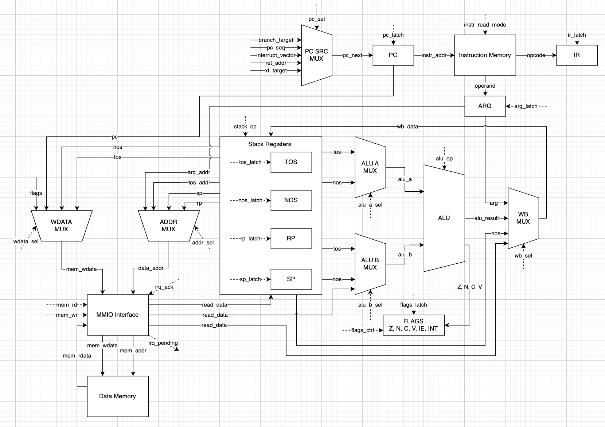
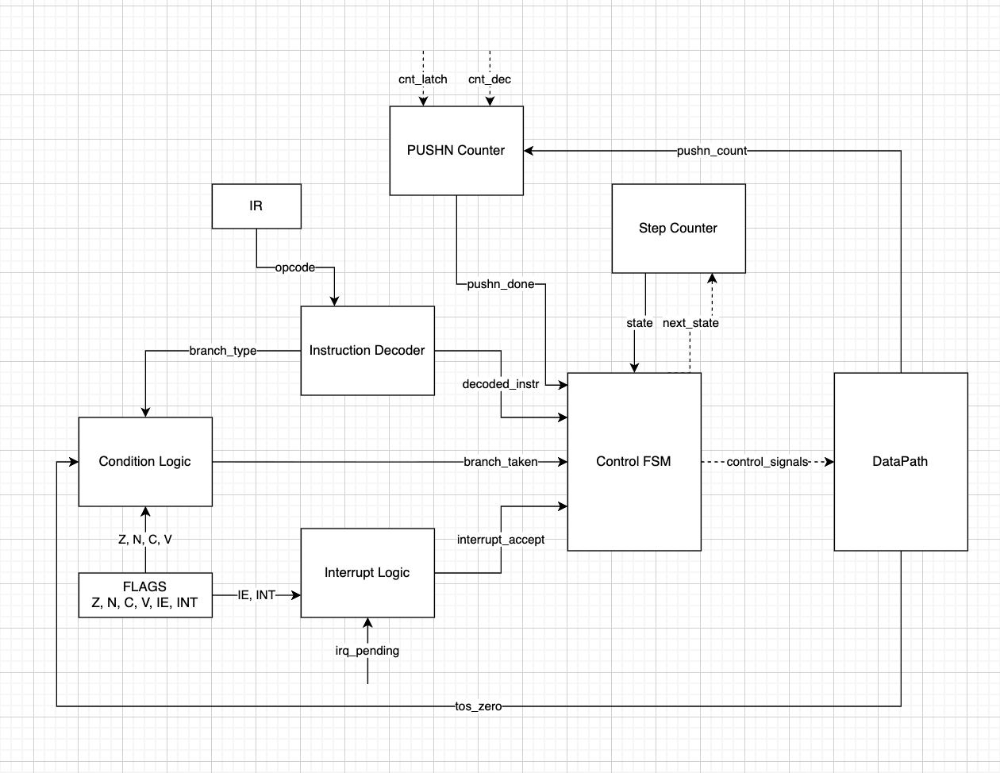

# Лабораторная работа №4. Эксперимент

## Автор
- ФИО: Ларионов Владислав Васильевич
- ИСУ: 466468
- Группа: P3209

## Вариант
```md
forth | cisc | harv | hw | tick | binary | trap | mem | pstr | prob1 | cache
```

| Опция | Реализация |
| --- | --- |
| `forth` | Минимальный Forth-подобный язык с обратной польской нотацией, процедурами и `execution token`. |
| `cisc` | Стековая CISC ISA: инструкции переменной длины, memory+ALU операции, управление спецрегистрами. |
| `harv` | Раздельные command memory и data memory; транслятор формирует отдельные бинарные образы. |
| `hw` | Блок управления проектируется как hardwired-автомат без микрокода. |
| `tick` | Модель процессора должна исполняться с точностью до такта и вести тактовый журнал. |
| `binary` | Машинный код и память данных сериализуются в настоящие бинарные файлы. |
| `trap` | Ввод реализуется через trap-прерывания по расписанию входных токенов; обработчик пишется на Forth. |
| `mem` | Ввод-вывод отображается в адресное пространство data memory. |
| `pstr` | Статические строки хранятся в data memory как Pascal-строки. |
| `prob1` | Обязательная программа: наибольший палиндром, являющийся произведением двух трехзначных чисел. |
| `cache` | Моделирование доступа к памяти через cache с отдельным описанием в разделе `Cache`. |

## Язык программирования

Исходный язык проекта -- минимальный Forth-подобный язык с обратной польской нотацией. Программа представляет собой последовательность токенов, которые исполняются слева направо. Основная структура исполнения -- стек данных; большинство слов берут аргументы с вершины стека и кладут результат обратно на стек.

### Синтаксис

Синтаксис описан в EBNF -- расширенной форме Бэкуса-Наура. Обозначения: `::=` означает "определяется как", `|` -- "или", `*` -- повторение ноль или больше раз, круглые скобки группируют варианты, квадратные скобки обозначают необязательную часть.

```ebnf
program              ::= element*
element              ::= definition
                       | interrupt-definition
                       | variable-definition
                       | constant-definition
                       | statement

definition           ::= ":" identifier statement* ";"
interrupt-definition ::= ":interrupt" identifier statement* ";"
variable-definition  ::= "variable" identifier
constant-definition  ::= literal "constant" identifier

statement            ::= literal
                       | string-literal
                       | word
                       | xt-literal
                       | if-statement
                       | begin-loop
                       | counted-loop

if-statement         ::= "if" statement* ("else" statement*)? "then"
begin-loop           ::= "begin" statement* "until"
counted-loop         ::= "do" statement* "loop"

xt-literal           ::= "'" identifier
word                 ::= identifier | builtin-symbol
literal              ::= integer
integer              ::= ["-"] digit+
string-literal       ::= "s" '"' string-char* '"'
identifier           ::= non-space-token
builtin-symbol       ::= "+" | "-" | "*" | "/" | "=" | "<" | ">"

comment              ::= "\" <any characters until end of line>
```

`identifier` здесь означает любой пользовательский токен без пробельных символов, который не является числом, строковым литералом или служебным словом синтаксиса. Полный список встроенных слов приведен в таблице минимального словаря.

Строковый литерал записывается как `s"text"` и компилируется в статическую Pascal-строку в памяти данных: первое машинное слово хранит длину строки, следующие слова -- коды символов. В исполняемый код попадает адрес начала строки.

### Семантика

Вычисления выполняются последовательно слева направо. Числовой литерал кладет значение на стек данных, строковый литерал кладет адрес статической Pascal-строки, а имя встроенного или пользовательского слова вызывает соответствующий код. Операции записываются в обратной польской нотации: выражение `(2 + 3) * 4` записывается как `2 3 + 4 *`.

Токены отделяются пробелами или синтаксисом строк. Строковый литерал `s"Hello"` считается одним токеном, даже если внутри строки есть несколько символов.

Слова работают с верхушкой стека. В описании стековых эффектов правое значение перед `--` считается вершиной стека: в записи `a b -- sum` значение `b` находится на вершине перед выполнением слова.

Область видимости:

- область видимости слов глобальная;
- пользовательские процедуры могут вызываться до текстового места определения, потому что транслятор сначала собирает таблицу определений;
- переменные и константы должны быть объявлены до использования;
- переменные и статические строки имеют глобальные имена;
- локальные области видимости на уровне языка не вводятся, чтобы не усложнять транслятор и модель.

Переменные и константы:

- `variable name` выделяет одно слово в памяти данных;
- обращение к `name` кладет на стек адрес этой ячейки;
- `N constant name` создает именованную константу;
- обращение к `name` кладет на стек значение `N`.

Типизация динамическая на уровне языка и машинно-словная на уровне процессора: все значения на стеке представлены машинными словами.

Execution token:

- значение, которое ссылается на исполняемое слово;
- токен получается словом `'` и выполняется словом `execute`;
- апостроф используется только когда нужно получить ссылку на слово как данные;
- без апострофа имя слова означает обычный вызов этого слова.

Процедуры:

- процедура определяется через `: name ... ;`;
- вызов процедуры сохраняет адрес возврата на стек возвратов процессора;
- после сохранения адреса возврата управление передается телу процедуры;
- `;` компилируется как возврат;
- в определении `:interrupt name ... ;` завершающий `;` компилируется как возврат из обработчика прерывания;
- аргументы и результат процедуры передаются через стек данных.

### Управление потоком

`if ... else ... then` снимает со стека предикат. Ноль означает ложь, любое ненулевое значение -- истину.

`begin ... until` повторяет тело, пока предикат на вершине стека равен нулю. В конце каждой итерации тело должно оставить предикат на стеке.

`do ... loop` -- счетный цикл. Перед `do` на стеке должны лежать `limit start`. Индекс цикла доступен через слово `i`. На каждой итерации индекс увеличивается на 1, цикл выполняется пока `i < limit`.

### Минимальный словарь

| Слово | Стековый эффект | Назначение |
|:------|:----------------|:-----------|
| `+` | `a b -- sum` | Сложение |
| `-` | `a b -- diff` | Вычитание |
| `*` | `a b -- prod` | Умножение |
| `/` | `a b -- quot` | Целочисленное деление |
| `mod` | `a b -- rem` | Остаток |
| `=` | `a b -- flag` | Равенство |
| `<` | `a b -- flag` | Меньше |
| `>` | `a b -- flag` | Больше |
| `and` | `a b -- flag` | Логическое И |
| `or` | `a b -- flag` | Логическое ИЛИ |
| `not` | `a -- flag` | Логическое НЕ |
| `dup` | `a -- a a` | Дублировать значение |
| `drop` | `a --` | Удалить значение |
| `swap` | `a b -- b a` | Поменять значения местами |
| `over` | `a b -- a b a` | Скопировать второе значение |
| `i` | `-- index` | Получить индекс текущего `do ... loop` |
| `load` | `addr -- value` | Прочитать слово из памяти данных |
| `store` | `value addr --` | Записать слово в память данных |
| `write-char` | `char --` | Записать символ в memory-mapped регистр вывода |
| `read-char` | `-- char` | Прочитать символ из memory-mapped регистра ввода |
| `input-ready?` | `-- flag` | Проверить флаг готовности memory-mapped ввода |
| `ei` | `--` | Разрешить trap-прерывания |
| `di` | `--` | Запретить trap-прерывания |
| `execute` | `xt --` | Выполнить execution token |
| `halt` | `--` | Остановить процессор |

Работа со строками реализуется словами на самом Forth. Это означает, что процессор не получает отдельные инструкции для строк: строка хранится в памяти данных как Pascal-строка, а обход, чтение длины и печать символов описываются обычными словами языка.

## Организация памяти

Архитектура памяти -- Harvard:

- память команд: `2^16` ячеек по 8 бит;
- память данных: `2^16` ячеек по 32 бита.

Память команд адресуется байтами. Это нужно для CISC-инструкций переменной длины: обычная команда занимает 1 байт opcode и 0, 2 или 4 байта операнда. Память данных адресуется 32-битными словами, потому что значения Forth, элементы `pstr`, переменные и стековые значения имеют размер одного машинного слова. Адреса памяти команд и памяти данных не смешиваются.

```text
Registers
+------------------------------------------+
| pc ir arg sp rp tos nos flags            |
+------------------------------------------+

Command memory, 8-bit cells
+------------------------------------------+
| 0000 : opcode                            |
| 0001 : operand high / immediate byte     |
| 0002 : operand low                       |
| ...  : procedure code                    |
| ...  : interruption handlers             |
| ...  : main                              |
+------------------------------------------+

Data memory, 32-bit cells
+------------------------------------------+
| 0000 : reserved/null                     |
| 0001 : pstr length / static data         |
| 0002 : pstr char                         |
| ...  : variables                         |
| D000 : data stack                        |
| E000 : return stack                      |
| FF00 : memory-mapped I/O                 |
+------------------------------------------+
```

Регистры процессора:

| Регистр | Размер | Назначение |
| --- | ---: | --- |
| `pc` | 16 бит | Байт-адрес следующего байта для выборки в памяти команд |
| `ir` | 8 бит | Opcode текущей инструкции |
| `arg` | 32 бита | Буфер операнда, собранного из следующих байтов команды |
| `sp` | 16 бит | Адрес слова на вершине стека данных |
| `rp` | 16 бит | Адрес слова на вершине стека возвратов |
| `tos` | 32 бита | Внутренний буфер вершины стека данных для ALU |
| `nos` | 32 бита | внутренний буфер второго элемента стека данных для ALU и стековых операций |
| `flags` | 6 бит | Флаги `Z`, `N`, `C`, `V`, `IE`, `INT` |

В начале выборки `pc` указывает на opcode текущей команды. Во время выборки opcode и операндов `pc` увеличивается, поэтому к началу исполнения команда уже находится в `ir`/`arg`, а `pc` указывает на следующий байт памяти команд.

Флаги:

- `Z` -- результат равен нулю;
- `N` -- результат отрицательный;
- `C` -- перенос в беззнаковой арифметике;
- `V` -- переполнение в знаковой арифметике;
- `IE` -- прерывания разрешены;
- `INT` -- процессор исполняет обработчик прерывания.

Отображение сущностей языка на память:

- инструкции, процедуры и обработчики `:interrupt` размещаются в памяти команд;
- `execution token` -- байтовый адрес процедуры в памяти команд;
- 16-битные адреса и относительные смещения кодируются двумя байтами после opcode;
- 32-битный числовой литерал кодируется четырьмя байтами после opcode;
- `pstr` занимает `len(string) + 1` слов данных: длина и символы;
- `variable` занимает одно 32-битное слово данных;
- временные значения размещаются на стеке данных;
- адреса слов данных `0xFF00..0xFFFF` зарезервированы под memory-mapped ввод-вывод.

Отображение портов ввода-вывода:

| Адрес | Назначение |
| --- | --- |
| `0xFF00` | входной символ |
| `0xFF01` | статус входа (`ready`) |
| `0xFF02` | выходной символ |
| `0xFF04` | подтверждение входного прерывания |

`read-char`, `write-char` и `input-ready?` обращаются к этим адресам штатными командами работы с памятью данных.

## Схемы

### DataPath



### ControlUnit



## Модель процессора

Модель `machine.py` исполняет бинарные образы command memory и data memory с точностью до такта. Управление реализовано как hardwired FSM со стадиями:

- `FETCH_OPCODE` -- чтение opcode, защелкивание `ir`, увеличение `pc` на 1;
- `FETCH_ARGUMENT` -- чтение операнда нужной длины, защелкивание `arg`, увеличение `pc`;
- `EXECUTE` -- выполнение управляющего сигнала или операции DataPath;
- `EXECUTE_PUSHN_VALUE` -- последовательное чтение 32-битных значений инструкции `PUSHN`;
- `INTERRUPT` -- вход в обработчик trap-прерывания.

CLI-интерфейс:

```bash
python3 machine.py <code_file> [data_file] [schedule_file] [limit]
```

`code_file` -- бинарный образ command memory, `data_file` -- бинарный образ data memory, `schedule_file` -- расписание входных токенов для trap-ввода, `limit` -- максимальное число тактов моделирования. Если рядом с `code_file` есть файл `<code_file>.interrupts`, модель автоматически использует его как таблицу адресов обработчиков прерываний.

На каждом такте модель сохраняет строку журнала со стадией автомата, `pc`, `ir`, `arg`, `tos`, `nos`, `sp`, `rp`, флагами, режимом `main/interrupt` и состоянием входного порта. В CLI выводятся результат программы и число тактов; репрезентативный префикс журнала фиксируется в golden manifest в поле `expected.log_head`.

## Cache

Cache размещается между memory-mapped интерфейсом и data memory. Для ISA используются обычные обращения к памяти: `LOAD`, `STORE`, `LOADA`, `STOREA`; различие относится к организации доступа к памяти на уровне модели процессора.

## Система команд

ISA -- стековая CISC. Операнды обычных вычислений лежат на стеке данных, поэтому большинство инструкций безадресные. CISC-свойства фиксируются отдельно:

- обычные инструкции имеют переменную длину: 1, 3 или 5 байтов;
- `ADDM` и `MULM` совмещают арифметику с чтением памяти данных;
- `EI` и `DI` напрямую изменяют бит `IE` в специальном регистре `flags`;
- `PUSHN` имеет переменное число аргументов и явно дочитывает дополнительные байты команды.

При выполнении ALU-инструкций вершина стека защелкивается во внутренний 32-битный регистр `tos`. Поэтому `ADDM addr` является операцией вида "регистр + память": `tos <- tos + DataMem[addr]`.

Операции `AND`, `OR` и `NOT` являются логическими, а не побитовыми: ноль считается ложью, любое ненулевое значение -- истиной. Результат логических операций нормализуется к флагу `0` или `1`.

### Кодирование

Первый байт каждой инструкции -- opcode. Многобайтные операнды кодируются в big-endian порядке. Тем же порядком сериализуются 32-битные слова памяти данных в бинарном файле.

```text
1-byte instruction:  opcode
3-byte instruction:  opcode arg_hi arg_lo
5-byte instruction:  opcode arg_31_24 arg_23_16 arg_15_8 arg_7_0
```

| Формат | Длина | Назначение |
| --- | ---: | --- |
| `OP` | 1 байт | неявная стековая безадресная |
| `OP addr16/rel16` | 3 байта | абсолютная или относительная адресация |
| `OP imm32` | 5 байтов | непосредственный 32-битный литерал |
| `PUSHN k v0 ... v{k-1}` | `2 + 4k` байтов | положить на стек переменное число 32-битных значений |

Виды адресации:

| Адресация | Пример | Смысл |
| --- | --- | --- |
| Неявная стековая | `ADD` | Операнды лежат на стеке |
| Непосредственная | `PUSHI32 10` | Операнд закодирован в команде |
| Абсолютная | `LOADA 0x0100` | Адрес слова data memory задан в команде |
| Косвенная | `LOAD`, `STORE` | Адрес слова data memory лежит на стеке |
| Относительная | `JZ +12` | Знаковое смещение в байтах относительно `pc` после текущей команды |

### Команды

| Инструкция | Opcode | Длина | Адресация | Стек | Семантика |
| --- | ---: | ---: | --- | --- | --- |
| `HALT` | `0x00` | 1 | неявная | `--` | Остановить модель |
| `DUP` | `0x01` | 1 | неявная | `a -- a a` | Дублировать вершину стека |
| `DROP` | `0x02` | 1 | неявная | `a --` | Удалить вершину стека |
| `SWAP` | `0x03` | 1 | неявная | `a b -- b a` | Обменять два верхних значения |
| `OVER` | `0x04` | 1 | неявная | `a b -- a b a` | Скопировать второе значение |
| `LOAD` | `0x05` | 1 | косвенная | `addr -- value` | Прочитать слово data memory по адресу со стека |
| `STORE` | `0x06` | 1 | косвенная | `value addr --` | Записать слово data memory по адресу со стека |
| `ADD` | `0x07` | 1 | неявная | `a b -- a+b` | Сложение |
| `SUB` | `0x08` | 1 | неявная | `a b -- a-b` | Вычитание |
| `MUL` | `0x09` | 1 | неявная | `a b -- a*b` | Умножение |
| `DIV` | `0x0A` | 1 | неявная | `a b -- a/b` | Целочисленное деление |
| `MOD` | `0x0B` | 1 | неявная | `a b -- a%b` | Остаток от деления |
| `EQ` | `0x0C` | 1 | неявная | `a b -- flag` | Проверить равенство |
| `LT` | `0x0D` | 1 | неявная | `a b -- flag` | Проверить `a < b` |
| `GT` | `0x0E` | 1 | неявная | `a b -- flag` | Проверить `a > b` |
| `AND` | `0x0F` | 1 | неявная | `a b -- flag` | Логическое И |
| `OR` | `0x10` | 1 | неявная | `a b -- flag` | Логическое ИЛИ |
| `NOT` | `0x11` | 1 | неявная | `a -- flag` | Логическое НЕ |
| `RET` | `0x12` | 1 | неявная | `--` | Вернуться из процедуры |
| `CALLXT` | `0x13` | 1 | неявная | `xt --` | Вызвать процедуру по `execution token` |
| `TOR` | `0x14` | 1 | неявная | `a --` | Перенести значение на стек возвратов |
| `FROMR` | `0x15` | 1 | неявная | `-- a` | Перенести значение со стека возвратов |
| `RPEEK` | `0x16` | 1 | неявная | `-- a` | Скопировать вершину стека возвратов |
| `EI` | `0x17` | 1 | неявная | `--` | Установить `IE = 1` в `flags` |
| `DI` | `0x18` | 1 | неявная | `--` | Установить `IE = 0` в `flags` |
| `IRET` | `0x19` | 1 | неявная | `--` | Вернуться из обработчика прерывания |
| `LOADA addr` | `0x1A` | 3 | абсолютная | `-- value` | Прочитать слово data memory по адресу из команды |
| `STOREA addr` | `0x1B` | 3 | абсолютная | `value --` | Записать слово data memory по адресу из команды |
| `ADDM addr` | `0x1C` | 3 | абсолютная | `a -- result` | Сложить `tos` с `DataMem[addr]` |
| `MULM addr` | `0x1D` | 3 | абсолютная | `a -- result` | Умножить `tos` на `DataMem[addr]` |
| `JMP rel` | `0x1E` | 3 | относительная | `--` | Безусловный переход |
| `JZ rel` | `0x1F` | 3 | относительная | `flag --` | Переход, если `flag = 0` |
| `CALL rel` | `0x20` | 3 | относительная | `--` | Вызвать процедуру по относительному смещению |
| `PUSHI32 imm` | `0x21` | 5 | непосредственная | `-- x` | Положить 32-битный литерал |
| `PUSHN k v0 ... v{k-1}` | `0x22` | `2+4k` | переменная | `-- v0 ... v{k-1}` | Положить на стек `k` 32-битных значений |

Прерывания не имеют отдельной инструкции ввода. Ввод-вывод выполняется через `LOAD`, `STORE`, `LOADA`, `STOREA` по memory-mapped адресам.

## Транслятор

Транслятор `translator.py` преобразует Forth-программу в два бинарных образа: память команд и память данных.

CLI-интерфейс:

```bash
python3 translator.py <input_file> <target_file>
```

Например:

```bash
python3 translator.py golden/hello/source.fth build/hello.bin
```

Основные выходные файлы:

- `<target_file>` -- бинарный образ command memory;
- `<target_without_bin>.data.bin` -- бинарный образ data memory, если `target_file` оканчивается на `.bin`;
- `<target_file>.interrupts` -- адреса обработчиков `:interrupt`, нужные модели для trap-ввода.

Дополнительно создаются отладочные файлы:

- `<target_file>.hex` -- человекочитаемый dump команд;
- `<target_without_bin>.data.bin.hex` -- dump data memory;
- `<target_file>.symbols` -- адреса сгенерированных меток и процедур.

Минимально для исполнения нужны бинарники команд и данных. Hex-dump и symbols не обязательны для модели, но нужны для проверки, отчета и диагностики. Файл `.interrupts` выделен отдельно, потому что обработчики прерываний лежат в command memory, а модель должна знать их адреса.

Трансляция выполняется в несколько этапов:

1. Исходный текст разбивается на токены.
2. Собираются определения слов, переменные, константы и обработчики `:interrupt`.
3. Генерируется код: литералы превращаются в `PUSHI32`, встроенные слова -- в инструкции ISA, управляющие конструкции -- в переходы.
4. Метки процедур и переходов заменяются на реальные адреса или относительные смещения.
5. Command memory и data memory записываются в бинарные файлы.

Отображение языковых конструкций на ISA:

| Конструкция Forth | Генерируемый код |
| --- | --- |
| `N` | `PUSHI32 N` |
| `s"text"` | размещение Pascal-строки в data memory и `PUSHI32 addr` |
| `variable x` | выделение одного слова data memory; обращение к `x` дает `PUSHI32 addr` |
| `N constant x` | обращение к `x` дает `PUSHI32 N` |
| `+`, `-`, `*`, `/`, `mod` | прямые ALU-инструкции |
| `=`, `<`, `>`, `and`, `or`, `not` | прямые инструкции сравнения и логики |
| `if ... else ... then` | `JZ` на ветку false и `JMP` через ветку else |
| `begin ... until` | метка начала цикла и `JZ` назад |
| `do ... loop` | код инициализации счетчика на return stack, проверка `i < limit`, обратный `JMP` |
| `' word` | `PUSHI32` с байтовым адресом процедуры |
| `execute` | `CALLXT` |
| вызов пользовательского слова | `CALL rel` |
| `read-char`, `input-ready?`, `write-char` | `LOADA`/`STOREA` по memory-mapped адресам |

Если в программе нет явного определения `main`, но есть top-level выражения, транслятор создает синтетическую процедуру `main` и помещает эти выражения в нее. Если `main` задан явно, top-level выражения запрещены, чтобы точка входа была однозначной.

### Пример трансляции

Исходная программа:

```forth
: square
  dup *
;

: inc
  1 +
;

5 square inc
```

Семантически программа вычисляет `(5 * 5) + 1`. Слова `square` и `inc` компилируются как отдельные процедуры, а top-level код `5 square inc` автоматически помещается в синтетическую процедуру `main`.

Сгенерированный dump command memory:

```text
0 - 20000B - CALL 11
3 - 00 - HALT
4 - 01 - DUP
5 - 09 - MUL
6 - 12 - RET
7 - 2100000001 - PUSHI32 1
12 - 07 - ADD
13 - 12 - RET
14 - 2100000005 - PUSHI32 5
19 - 20FFEE - CALL -18
22 - 20FFEE - CALL -18
25 - 12 - RET
```

Полученные метки:

```text
word:square = 4
word:inc    = 7
word:main   = 14
```

## Тестирование

Запуск всех тестов:

```bash
python3 -m unittest discover -s golden -v
```

CI настроен в [`.github/workflows/ci.yml`](./.github/workflows/ci.yml): на `push` и `pull_request` выполняются `ruff`, `mypy`, компиляция Python-файлов и golden-тесты.

Golden-кейсы лежат в каталоге [`golden`](./golden). Каждый кейс хранит исходный Forth-код в `source.fth` и один manifest `case.toml` с входным schedule, лимитом тактов и ожидаемыми артефактами:

- `expected.code_hex` -- dump command memory;
- `expected.data_hex` -- dump data memory;
- `expected.interrupts` -- адреса обработчиков `:interrupt`;
- `expected.stdout` -- вывод `machine.py` и число тактов;
- `expected.log_head` -- репрезентативный префикс тактового журнала.

Тест [`golden/test_golden.py`](./golden/test_golden.py) для каждого кейса запускает реальный CLI-пайплайн:

```bash
python3 translator.py <case>/source.fth program.bin
python3 machine.py program.bin program.data.bin input.schedule <limit>
```

`machine.py` автоматически читает `program.bin.interrupts`, если файл существует рядом с command memory.

Сейчас заведены golden-кейсы:

| Кейс | Что проверяет |
| --- | --- |
| [`hello`](./golden/hello) | вывод статической Pascal-строки |
| [`cat_interrupt`](./golden/cat_interrupt) | trap-ввод и обработчик `:interrupt` |
| [`hello_user_name`](./golden/hello_user_name) | prompt, ввод имени по расписанию, вывод приветствия |
| [`sort_three`](./golden/sort_three) | чтение трех цифр через trap и сортировка |
| [`double_precision`](./golden/double_precision) | сложение 64-битных значений, представленных парой `hi:lo` |
| [`prob1_palindrome`](./golden/prob1_palindrome) | Euler problem 4: наибольший палиндром-произведение двух трехзначных чисел |

В `prob1_palindrome` перебор сужен без потери результата: для шестизначного палиндрома один из множителей делится на 11, поэтому одна сторона цикла перебирает только кратные 11. Найденный результат `906609` также больше `899 * 999`, значит пары с множителем ниже 900 уже не могут дать больший ответ.
